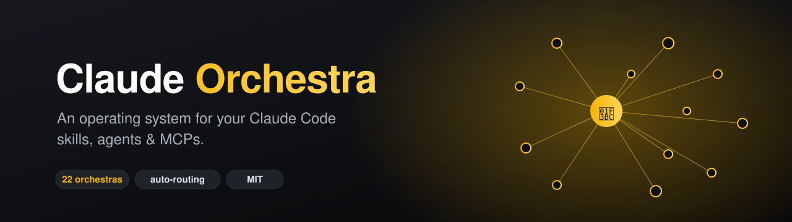
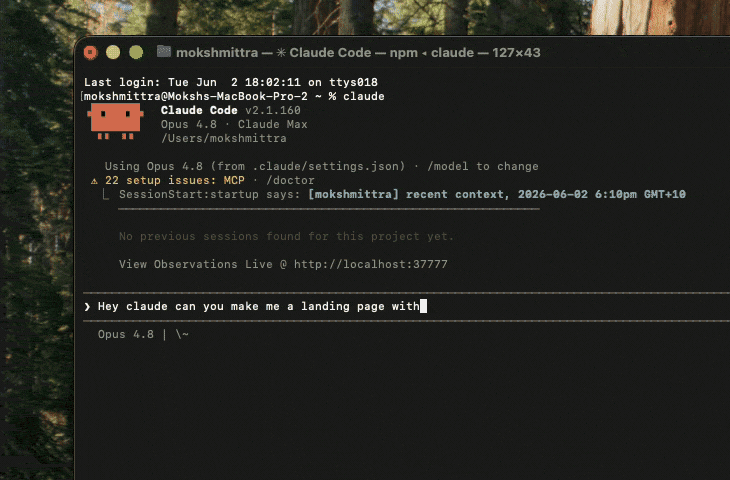
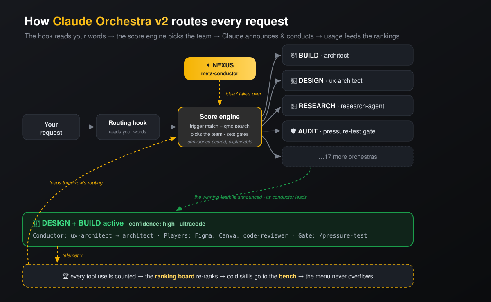

<div align="center">



# 🎼 Claude Orchestra

**An operating system for your Claude Code skills, agents & MCPs.**


</div>

---

I went from zero coding to 500+ Claude Code skills, agents, and MCP servers installed in a
few months. At some point I had no idea what was active, what would fire for a given task,
or whether I'd installed the same thing three times. More tools had made me *slower*.
**Claude Orchestra is what I built to fix that.**

> **Built to be forked.** This isn't a one-click install you forget about — it's a template
> you fork, customize with *your* rosters, and run on your own machine.

## The problem

```
WITHOUT Claude Orchestra:

  ~/.claude/ → 247 skills · 40 agents · 12 MCPs · 8 plugins
  → "Which one handles this task?"               🤷
  → "Did I install something for this already?"  🤷
  → "Why did THAT skill just fire?"              🤷
  → "⚠ skills exceed the character budget"       😱 (Claude literally can't see your menu)

WITH Claude Orchestra:

  🎼 BUILD active · Conductor: architect · Using: code-reviewer, debugger, gh
  [the actual response continues here]

  + a live ranking board of every tool you own, from real usage
  + a doctor that keeps your skill menu inside Claude's budget
```

Every prompt announces exactly what's playing. No more guessing.

## The fix: 22 orchestras + a score engine

Claude Orchestra files every tool into themed **orchestras**. Each has **one conductor** that
sequences its players, clear **triggers**, and quality **gates**. A routing hook reads every
request, scores it deterministically, and activates the right orchestra(s) — announced, every time.



| | |
|---|---|
| 🧭 **Prompt-aware routing** | The hook reads your actual words and injects only the matched orchestras + pre-ranked players (word-boundary trigger scoring, confidence levels, NEXUS override) |
| 🧠 **Brain layer** | `skill-selector` picks the right player when several overlap (scored, explained, asks below 70% confidence) · `hallucination-guard` blocks "should work" claims · the `auditor` agent defaults every high-stakes output to NEEDS WORK until evidence flips it |
| 🔎 **Semantic search (optional)** | Plug in [`qmd`](https://github.com/tobi/qmd) for local BM25 + vector + rerank retrieval over every skill — paraphrases route correctly at any scale |
| 🏆 **Ranking board** | `orchestra board` ranks every skill/agent/MCP/plugin S/A/B/C from tier + **real usage telemetry** (local-only) — [worked example](examples/RANKING-BOARD.md) |
| 📉 **"Too many skills" fix** | `orchestra doctor` measures your skill-discovery budget and prints the exact `bench` commands to get healthy — [docs/SCALING-SKILLS.md](docs/SCALING-SKILLS.md) |
| 🧠 **Reasoning escalation** | Each orchestra carries an ultra keyword (`ultrathink` / `ultraplan` / `ultracode` / `ultrareview`) injected automatically for hard domains |
| ⏰ **Upkeep** | `orchestra upkeep` weekly via cron (`orchestra cron` prints the line), or `/loop 24h "run orchestra upkeep"` in cloud sessions |

## The 22 orchestras

| # | Orchestra | What it does |
|---|---|---|
| 🌐 | **NEXUS** *(meta-conductor)* | Turns "I have an idea" into a sequenced multi-orchestra plan |
| ① | **BUILD** | Ship working, reviewed code |
| ② | **DESIGN** | Beautiful, on-brand interfaces |
| ③ | **RESEARCH** | Know more than the competition |
| ④ | **MARKETING** | Reach the right people |
| ⑤ | **CONTENT** | Words and creative that convert |
| ⑥ | **SEO + GEO** | Win search and AI answers |
| ⑦ | **LEAD GEN & SALES** | Find clients, close deals |
| ⑧ | **PRODUCT** | Build the right thing |
| ⑨ | **VIDEO + MEDIA** | Generate and edit video/image |
| ⑩ | **ANALYTICS** | Measure everything |
| ⑪ | **KNOWLEDGE & MEMORY** | Remember and connect everything |
| ⑫ | **DOCUMENTS & REPORTS** | Polished deliverables |
| ⑬ | **PAID ADS** | Ads that profit |
| ⑭ | **AUTOMATION & OPS** | Automate what repeats |
| ⑮ | **AI/ML DEVELOPMENT** | Build AI systems |
| ⑯ | **MOBILE** | Ship mobile apps |
| ⑰ | **PLANNING & PM** | Plan before building |
| ⑱ | **GROWTH & CONVERSION** | Users → revenue |
| ⑲ | **FINANCE** | Investment research and financial modelling |
| ⑳ | **EXECUTIVE ADVISORY** | Founder-grade strategic counsel |
| ㉑ | **AUDIT** | Verify everything. Defaults to NEEDS WORK. |
| ㉒ | **CYBERSECURITY** | Defend, detect, respond — and prove it |

Every orchestra has one conductor, a roster, trigger words, allowances (what needs your OK), and
a quality gate. Delete, merge, or rename freely — it's your taxonomy.

## What's inside v3

- **The score engine** (`orchestra` CLI) — deterministic routing, inventory, ranking board,
  budget doctor, bench/promote, usage telemetry, weekly upkeep
- **㉑ AUDIT + ㉒ CYBERSECURITY orchestras** — AUDIT ships with its conductor
  ([`agents/auditor.md`](agents/auditor.md)): defaults to NEEDS WORK, demands fresh evidence,
  bounces work back with specific fixes (max 3 attempts)
- **The brain layer** — [`skill-selector`](skills/skill-selector/SKILL.md) (transparent scoring
  between overlapping tools) + [`hallucination-guard`](skills/hallucination-guard/SKILL.md)
  (Karpathy principles, the Iron Law, ASK_HUMAN as a first-class status)
- **Harmony — 3-Layer Ensemble** — each activation builds an ensemble (Active ≥0.70 · Standby
  0.55–0.69 · Reserve named-only), so the best *combination* fires, not just the top match
- **Rule 14 — Internal-First Search Ladder** — knowledge base → `~/.claude` → score archive →
  only then the web. Stops re-buying knowledge you already own
- **Calibration Loop** — every failure becomes a named doctrine anchor; the same mistake can't
  happen twice
- **NEXUS phase map** — ideas sequence through 7 phases (Discovery → … → Operate), with an
  AUDIT verdict required before Launch

### How NEXUS sequences orchestras

| Phase | Orchestras |
|---|---|
| 0 — Discovery | RESEARCH · PRODUCT · KNOWLEDGE |
| 1 — Strategy | PRODUCT · PLANNING · MARKETING |
| 2 — Foundation | PLANNING · DESIGN |
| 3 — Build | BUILD · DESIGN · AI/ML · MOBILE |
| 4 — Hardening | BUILD (QA) · AUTOMATION · CYBERSECURITY · **AUDIT** *(verdict required before Phase 5)* |
| 5 — Launch | MARKETING · CONTENT · SEO · PAID ADS · GROWTH |
| 6 — Operate | ANALYTICS · GROWTH · AUTOMATION · DOCUMENTS |

### Cross-cutting disciplines

Some skills apply across ALL orchestras regardless of which fired — they run on discipline,
not routing: `brainstorming` before creative work, `writing-plans` before multi-step builds,
`verification-before-completion` before any "done" claim (the Iron Law), `systematic-debugging`
on non-trivial bugs, `test-driven-development` on new features.

---

## Requirements

| Need | Why | Install |
|---|---|---|
| **Claude Code** | The host this routes inside | https://claude.com/claude-code |
| **Bash 3.2+** | Installer + engine are Bash | macOS / Linux preinstalled |
| **`jq`** | Safely merges `settings.json` (no clobbering) | `brew install jq` · `apt-get install jq` |
| *optional* **`qmd`** | Local semantic search for paraphrase-proof routing | `bun install -g @tobilu/qmd` |

That's it. No Python, no npm, no Docker — `qmd` is a nice-to-have, never required.

---

## Install — the audit-first path (recommended)

```bash
# 1. Clone
git clone https://github.com/Momo2323-ui/claude-orchestra
cd claude-orchestra

# 2. Audit — read what you're about to run
cat install.sh

# 3. Install — idempotent, backs up everything before any change
./install.sh            # or: ./install.sh --guided   (confirm each step)
                        # or: ./install.sh --dry-run  (print actions, touch nothing)

# 4. Verify what changed
diff "$(ls -t ~/.claude/settings.json.bak.* | head -1)" ~/.claude/settings.json
~/.claude/orchestra/bin/orchestra doctor

# 5. Customize — fill your rosters
$EDITOR ~/.claude/orchestra/registry.json ~/.claude/rules/orchestra-system.md
```

Open a new Claude Code session — the router fires on your next prompt.

## Install — the fast path

```bash
curl -fsSL https://raw.githubusercontent.com/Momo2323-ui/claude-orchestra/main/install.sh | bash
```

Or let Claude Code drive it: `Install this for me: https://github.com/Momo2323-ui/claude-orchestra`

**Want to reverse it?** `./uninstall.sh` — full walkthrough in [UNINSTALL.md](UNINSTALL.md).

---

## What the installer actually does

| Target | Action |
|---|---|
| `~/.claude/skills/{orchestra-router,orchestra-intake,hallucination-guard,skill-selector}` | Created (refreshed if exists) |
| `~/.claude/agents/auditor.md` | Copied (backup first if exists) |
| `~/.claude/hooks/{orchestra-route.sh,orchestra-telemetry.sh}` | Copied + `chmod +x` |
| `~/.claude/orchestra/bin/orchestra` | The score engine CLI |
| `~/.claude/orchestra/registry.json` | Template **only if not present** — yours wins |
| `~/.claude/rules/orchestra-system.md` | Template **only if not present** — yours wins |
| `~/.claude/settings.json` | One entry each in `UserPromptSubmit` + `PostToolUse` (auto-backup first) |
| `~/.claude/CLAUDE.md` | Orchestra rule appended **only if marker not present** |
| `~/.claude/.orchestra-scan.md` | Inventory of your installed tools, ready for `orchestra-intake` |

No network calls (except the curl-pipe path cloning this repo), no `sudo`, no telemetry beyond a
**local-only** usage log you can delete. Full breakdown in [**SECURITY.md**](SECURITY.md).

---

## How it works



1. **The constitution** (`orchestra-system.md`) — your orchestras: rosters, conductors, triggers, gates, doctrine.
2. **The registry** (`orchestra/registry.json`) — its machine-readable twin; the engine routes, ranks, and doctors from it.
3. **The routing hook** reads each prompt, scores it (`orchestra route`), and injects the matched slice: orchestras, conductors, pre-ranked players, gates, reasoning keyword, confidence.
4. **The brain layer** — `skill-selector` picks between overlapping players; `hallucination-guard` gates entries, exits, and every "done"; the `auditor` agent verdicts high-stakes work.
5. **The telemetry hook** logs what actually fires → **`orchestra board`** keeps a live S/A/B/C ranking of your whole toolkit.
6. **The intake skill** files every new install into constitution + registry — never archived.

→ Full walkthrough: [`docs/HOW-IT-WORKS.md`](docs/HOW-IT-WORKS.md) · audit trail: [`docs/AUDIT-2026-06.md`](docs/AUDIT-2026-06.md) · stuck? [`docs/TROUBLESHOOTING.md`](docs/TROUBLESHOOTING.md)

## Build your own orchestras

[`docs/CREATE-YOUR-ORCHESTRA.md`](docs/CREATE-YOUR-ORCHESTRA.md) walks you through mapping
*your* tools into orchestras in about ten minutes.

## See a real setup

- [`examples/my-20-orchestras.md`](examples/my-20-orchestras.md) — a real config: rosters and the reasoning behind each placement
- [`examples/registry-filled.json`](examples/registry-filled.json) — its machine twin (a real 90-tool stack: skills, agents, 18 MCP connectors)
- [`examples/RANKING-BOARD.md`](examples/RANKING-BOARD.md) — the ranking board the engine generates from it
- [`examples/01-real-prompts.md`](examples/01-real-prompts.md) — five real prompts → the exact routing each produces

---

## FAQ

**Does this install any skills/agents for me?** Only its own machinery (router, intake,
hallucination-guard, skill-selector, auditor). It never bundles third-party tools — the example
config links to skills at their original repos so authors get the credit.

**Will it overwrite my settings?** No. Everything is backed up before mutation, merged with `jq`,
and your customized constitution/registry always win on re-install.

**I got the "your skills are too much" warning — does this fix it?** Yes, that's a headline
feature: `orchestra doctor` measures your budget and prints the exact `bench` commands to get
healthy. Benched skills stay indexed and usable by name. See [docs/SCALING-SKILLS.md](docs/SCALING-SKILLS.md).

**Does routing slow my prompts down?** No. Trigger scoring is instant (bash + jq). Semantic
search via qmd adds ~1–2s and is opt-in (`orchestra qmd on`).

**Do I have to use all 22 orchestras?** No. Delete, merge, or rename freely. Running solo?
Merging down to ~8 works great.

**Does the curl installer give me the orchestras?** It installs the *infrastructure*. The
22-orchestra roster is a template you customize — that's the point.

**Do I need NEXUS?** No — it's optional. Delete the section if you don't want a meta-conductor.

**Can I uninstall?** Yes — `./uninstall.sh` (benched skills restored first, your data kept unless
`--purge`). Manual steps in [UNINSTALL.md](UNINSTALL.md).

---

## Roadmap · Security · Contributing

- **Where this is going (and what it deliberately won't become):** [ROADMAP.md](ROADMAP.md)
- **Every byte the installer touches + how to audit it:** [SECURITY.md](SECURITY.md)
- **PRs welcome:** [CONTRIBUTING.md](CONTRIBUTING.md) — note for AI-assisted contributors:
  verify every command and feature in your PR actually exists in this repo. We've had AI-drafted
  PRs invent features; those get closed.

## Credits

Built by [Moksh Mittra](https://github.com/Momo2323-ui). MIT licensed — use it freely. Every
skill referenced in the examples links to its original author. Inspiration credited in-file:
Karpathy's principles, Superpowers' Iron Law, NEXUS QA loops, CrewAI/Swarm handoff patterns.
